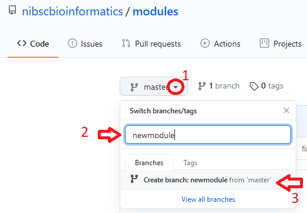
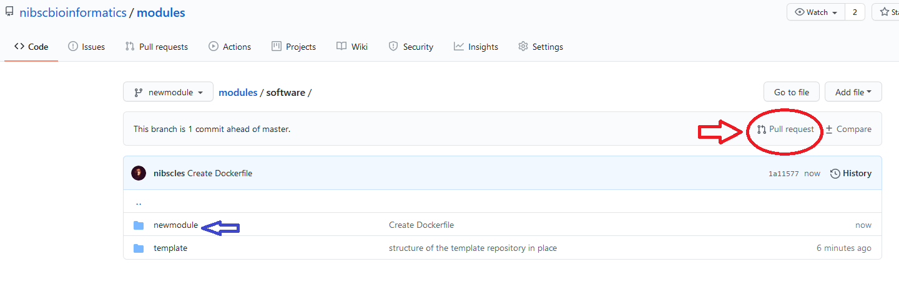
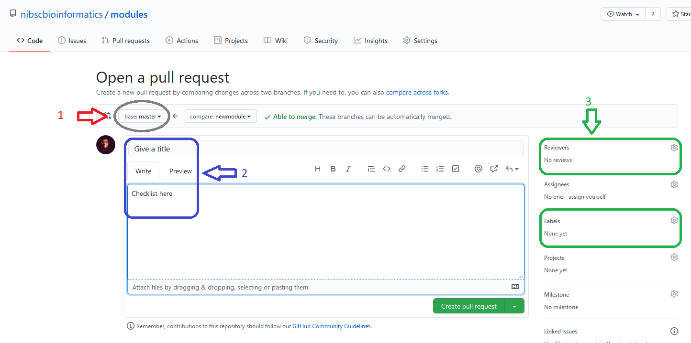

# NIBSC Bioinformatics Nextflow Modules

General scope

## NF-Core

### nf-core principles

[nf-core modules guidelines](https://github.com/nf-core/modules/blob/master/README.md)

### contributions and overlaps

[upload to *nf-core/modules*](https://github.com/nf-core/modules#uploading-to-nf-coremodules)

## How to add a new Module

### Create new branch

### Subcommands

## How to use the base template

### Identify test data

(Github maximum file size is 100MB)

### Modify the container

### Modify the module code

**module settings** in a central config

**sample metadata** in a map

### Write a test script

### Modify container build github action

### Modify module test github action

## Submit your module with a Pull Request

